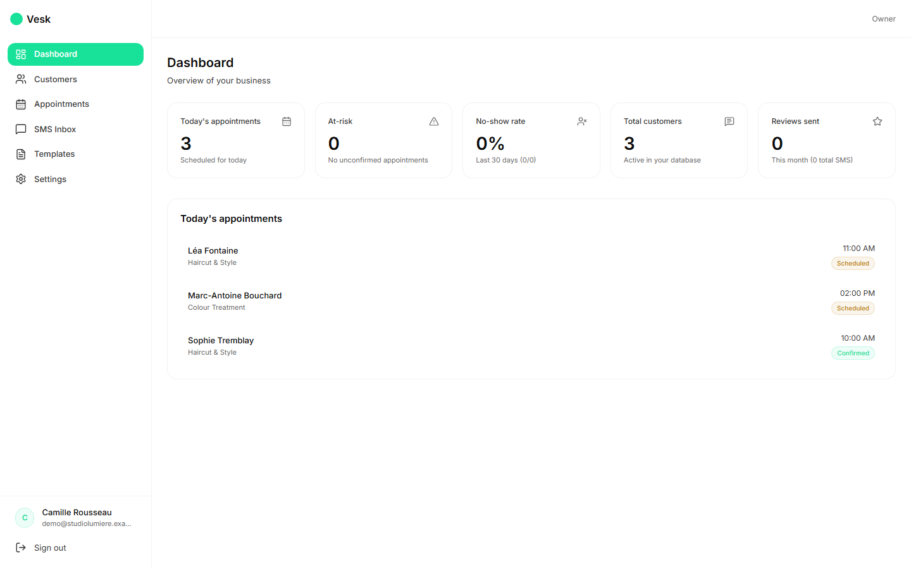
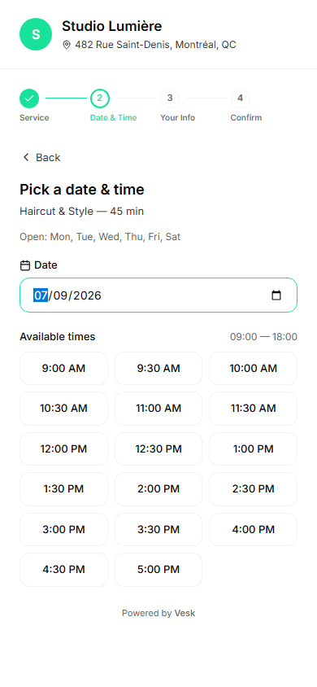

# Vesk ✨

**Vesk sends the reminder, reads the reply, and asks for the review — so a 3-chair salon doesn't have to.**

<table>
<tr>
<td width="65%" valign="top">

<sub>Owner dashboard — live status per appointment, no-show rate, at-risk flags.</sub>
</td>
<td width="35%" valign="top">

<sub>Public booking, no account needed — <code>/book/{slug}</code>.</sub>
</td>
</tr>
</table>

## How it's built



*(More diagrams — event flow, SMS sequence, appointment state machine — in [`docs/architecture-all.md`](docs/architecture-all.md).)*

---

## 💡 Why this exists

Small businesses don't lose money because they're bad at their craft. They lose it in the gaps between appointments — no-shows, silent customers, reviews that never got asked for, reminders sent in the wrong language.

The owner of a 3-chair salon doesn't want a CRM or another dashboard. They want the *outcome*: full chairs, clients on time, 5-star reviews rolling in. Everything else is overhead.

Existing tools make them work harder. Booking software sends dumb reminders at fixed hours. Marketing tools spam everyone with the same campaign. Review platforms ask for feedback at random. And almost all of them are English-only — a non-starter in Montreal, Québec City, or half of Ontario.

Vesk flips this. The AI *is* the workflow, not a chatbot bolted onto one. It picks when to remind, in which language, using which tone. It reads incoming replies and updates the appointment with no human in the loop. It waits for the right moment to ask for a review, and only asks clients likely to leave a good one.

**The bet:** the next generation of SMB software won't have settings pages. It will have outcomes, and an AI agent that takes responsibility for them.

---

## 🚀 What it does

- **Smart bilingual reminders.** Per-client language (FR/EN), per-client send-time picked by an LLM agent based on past response patterns — not a static 24h-before rule.
- **Conversational SMS, both directions.** Inbound replies are intent-classified, matched to the appointment, and answered or rescheduled automatically. A reschedule link drops the client on a mobile public booking page.
- **Automatic review recovery.** Post-appointment, a deterministic cooldown gate + AI confidence score decide who gets a review request. Link goes straight to Google, Facebook, or Trustpilot.
- **Public booking without an account.** Every tenant gets `/book/{slug}`. Pick service → slot → phone → confirm. Consent capture and phone-based dedup are handled server-side.
- **No-show scoring + at-risk flags.** Rolling per-customer score, extra confirmation touch for at-risk appointments, auto-completion when end time passes.
- **Owner-grade dashboard.** Live feed over SignalR, weekly stats, at-risk list — glanceable on a phone between clients.

---

## 🧭 Design principles

- **The application is the source of truth.** Business rules never live in a prompt. Consent checks, cooldown windows, business-hours gates, status transitions — deterministic C# that runs *before* any LLM call. The AI decides timing, tone, and intent; the code enforces what's legal and possible.
- **Multi-tenant isolation is a precondition, not a feature.** `TenantId` on every entity, EF Core global query filters on every query, tenant validation on every Service Bus message, cross-tenant tests on every CI run. A tenant leak is product-ending, so it's built to be impossible.
- **Privacy-first.** Soft delete everywhere, GDPR-style anonymization on customer delete, append-only consent log. Column-level encryption on phone/email is in progress.
- **Events, not cron jobs.** No Hangfire, no Quartz. Scheduling = Azure Service Bus deferred messages with sequence numbers stored on the row, so anything can be cancelled deterministically on reschedule or cancel.
- **One monolith, nine bounded contexts.** Tenants · Identity & Auth · Customers · Appointments · Messaging · Campaigns · AI/Agents · Billing · Analytics. Modules never touch each other's `DbContext` — ArchUnitNET tests fail the build if they do.

---

## 🩹 Failure modes and lessons

Real incidents from building this, not hypotheticals — the failure, the root cause, and the fix.

**1. The AI agent scheduled a reminder in the past — and lied about the time in it.**
Early on, the reminder-optimization LLM agent picked its own send time *and* wrote the "time remaining" text itself. Live testing on a 2-hour-out appointment showed it scheduling the urgent reminder in the past, with body text saying "in 3h" when the real gap was 1 hour — a message that would dispatch immediately with wrong information.
*Root cause:* a business rule (accurate time math) was delegated to the LLM instead of enforced in code — a direct violation of the project's own "AI never owns hard gates" rule.
*Fix:* moved time-phrase formatting into deterministic C# (`ReminderTimePhrase`), added a `{time_until}` token the agent must use instead of writing a number, and made the scheduling tool reject any `sendAt` in the past or at/after the appointment start. The agent proposes; the tool call is the actual gate.

**2. Three things sending SMS at once corrupted the monthly usage counter.**
Concurrent SMS sends for the same tenant — an inbound reply, the reminder dispatcher, and the no-show worker — all hit the same `(plan, year, month)` usage row with a read-then-insert find-or-create. Under concurrency this raced the unique constraint and threw a Postgres `23505`, surfacing as flaky test failures and a live 500 risk.
*Root cause:* "check then write" isn't atomic, and three independent code paths had each grown their own copy of the same find-or-create logic.
*Fix:* replaced all three call sites with one shared `UsageTracker.IncrementSmsSentAsync` doing `INSERT … ON CONFLICT DO UPDATE`, so concurrent sends serialize in the database instead of racing in application code.

**3. A dev-only JWT secret sat in the public repo's history.**
`appsettings.Development.json` — carrying a JWT signing key and a local DB password — was tracked in git from an early commit onward. It's a demo project, not a production one, but "public repo with a committed secret" is exactly the kind of thing that gets flagged, and rotating it after the fact doesn't remove it from history.
*Root cause:* the default `dotnet new` template tracks `appsettings.*.json` by default, and nothing in the early setup opted the Development file out.
*Fix:* untracked both API and Workers dev config, added `.example` templates for onboarding, pinned every CI Action to a commit SHA, and added job timeouts + broader secret-scanning triggers so the gap (and the class of gap) doesn't recur. Removing a secret rewrites nothing in history — it stayed rotated instead.

**4. The frontend was hammering `/auth/refresh` on every page load.**
QA noticed a burst of ~12 aborted `/auth/refresh` calls per user journey. The `AuthProvider` bootstrap and the axios 401 interceptor each independently fired their own refresh call, and optimistic rendering kicked off page queries before the token was even set — so multiple 401s could each trigger their own refresh in parallel.
*Root cause:* two independent code paths assumed they were the only thing that could trigger a refresh; neither knew about the other.
*Fix:* one shared single-flight `refreshSession()` in `lib/api.ts` that both paths call into, replacing the interceptor's ad-hoc queuing. Aborted calls per journey dropped from ~12 to ~4 (the remainder are unrelated navigation-cancel aborts).

---

## 🛠️ Tech

**Backend**
- .NET 8 minimal APIs, MediatR for in-process domain events, `Result<T>` on all service boundaries
- EF Core 8 on PostgreSQL, snake_case, global query filters on every entity
- Azure Service Bus for scheduled messages, integration events, and worker queues
- Azure OpenAI (`Azure.AI.OpenAI`) for reminder optimization, intent classification, review confidence
- Twilio SMS behind `ISmsProvider` (fake provider for tests and local dev)
- SignalR for real-time dashboard, Seq for local structured logs

**Frontend**
- React 18 + TypeScript (strict, no `any`)
- TanStack Query for server state, React Hook Form + Zod for forms
- Tailwind + shadcn/ui, Mintlify-inspired design system (see [`DESIGN.md`](DESIGN.md))
- JWT in memory, refresh token in `httpOnly` cookie, code-split public booking flow

**Infra**
- Azure Bicep in `infra/`, Docker Compose for local PostgreSQL + Seq

---

## 📁 Repository layout

```
Vesk.sln
├── src/
│   ├── Vesk.Api/            Controllers, middleware, DI root
│   ├── Vesk.Application/    MediatR handlers, DTOs, agent orchestration
│   ├── Vesk.Domain/         Entities, enums, domain events
│   ├── Vesk.Infrastructure/ EF Core, Twilio, Service Bus, Azure OpenAI
│   ├── Vesk.Workers/        IHostedService workers, Service Bus consumers
│   ├── Vesk.Shared/         Result<T>, Error types, guards, interfaces
│   └── Vesk.Web/            React + Vite frontend
├── tests/
│   ├── Vesk.UnitTests/
│   ├── Vesk.IntegrationTests/     Tenant isolation, idempotency, consent gate
│   └── Vesk.Architecture.Tests/   ArchUnitNET: no cross-module leaks
├── infra/                        Azure Bicep
└── docs/                         Architecture diagrams, sprint plans
```

---

## ⚡ Getting started

```bash
# Local infra
docker compose up -d                 # PostgreSQL + Seq

# Backend
dotnet build Vesk.sln
dotnet ef database update --project src/Vesk.Infrastructure --startup-project src/Vesk.Api
dotnet run --project src/Vesk.Api

# Frontend (separate terminal)
cd src/Vesk.Web
npm install
npm run dev

# Tests
dotnet test Vesk.sln
```

API on `https://localhost:7xxx`, web on `http://localhost:5173`. Register a tenant from the UI — the account is seeded with FR + EN templates and a default plan. `start.ps1` / `stop.ps1` at the repo root bring the full stack up and down on Windows.

---

## 📍 Status

Sprint 1 shipped the full MVP demo loop: auth, tenants, customers with consent, appointments, bilingual reminder workflow, public booking, review request flow, real-time dashboard. Sprint 2 is the path to Azure production — column encryption, per-tenant Twilio provisioning, at-risk polish, auto-completion worker. See [`docs/sprint1.md`](docs/sprint1.md) and [`docs/sprint2.md`](docs/sprint2.md).

---

<sub>Vesk was built as FlowPilot AI, briefly rebranded Relora AI, and now ships as Vesk — the source tree, namespaces, and repo have all been renamed to match.</sub>
