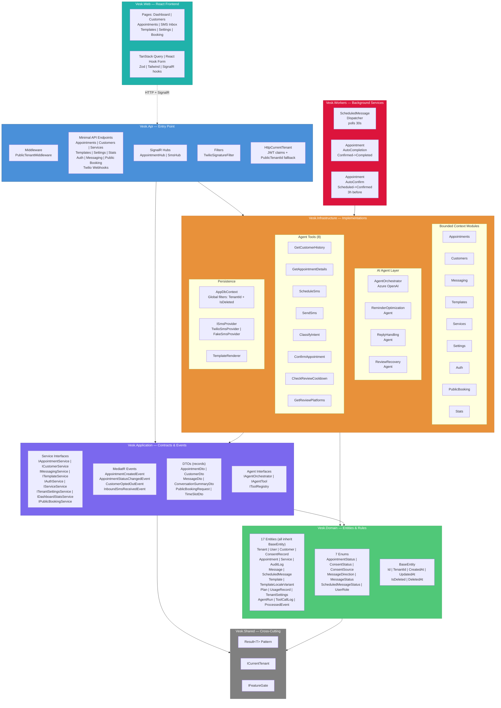
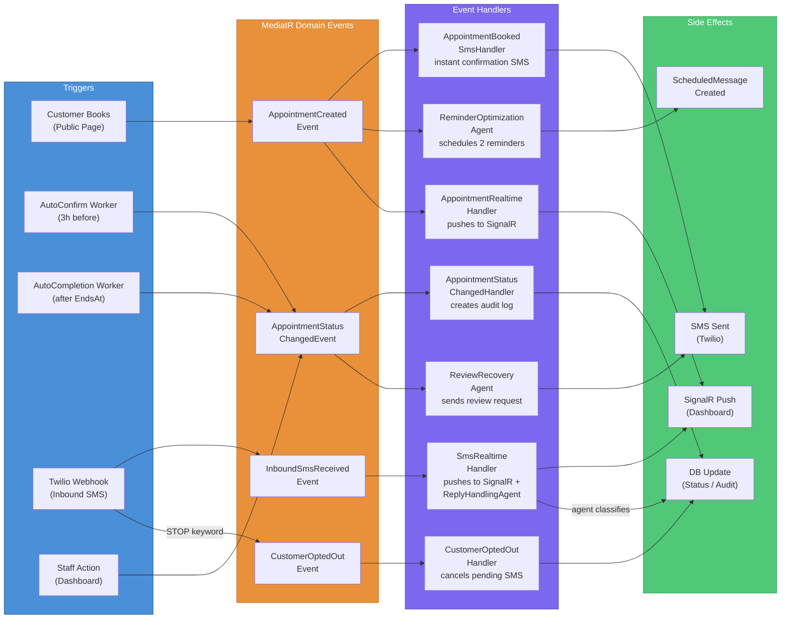
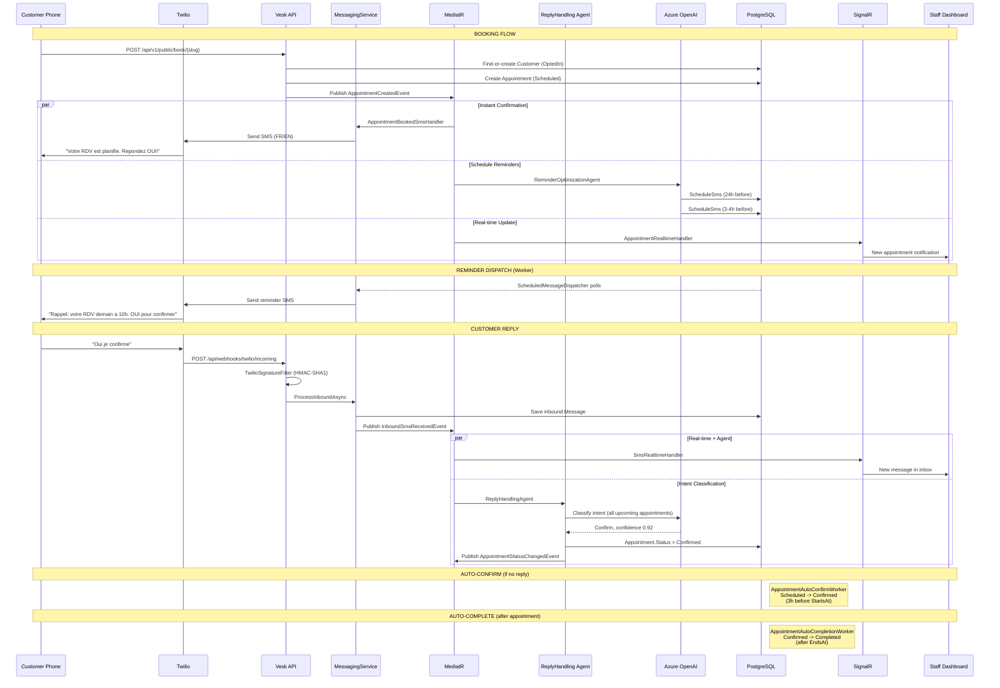
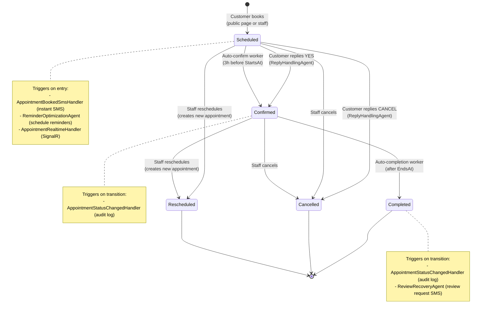

# Vesk AI — Architecture Documentation

## 1. System Architecture — Layers & Components

## 2. Event-Driven Architecture — MediatR Event Flow

## 3. End-to-End SMS Lifecycle — Sequence Diagram

## 4. Appointment State Machine

